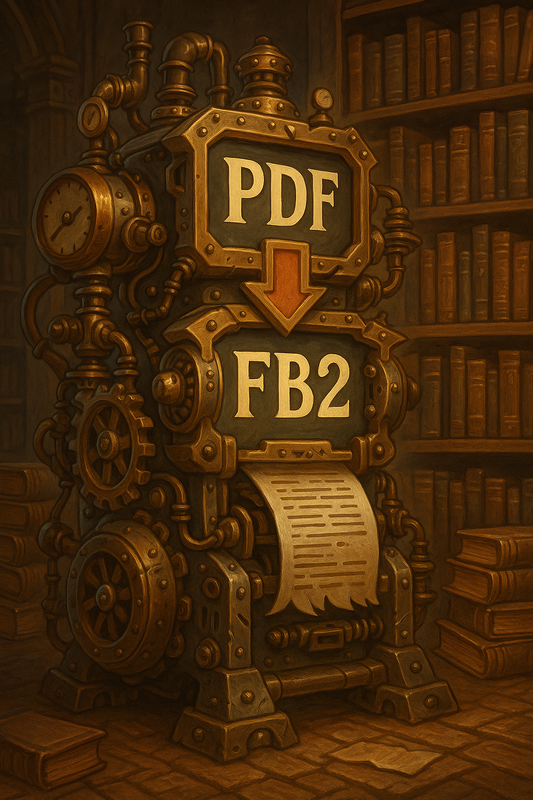
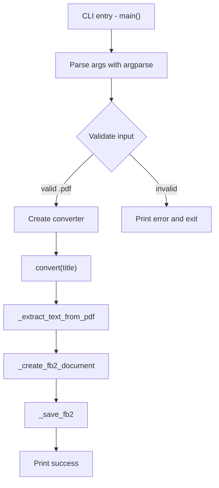
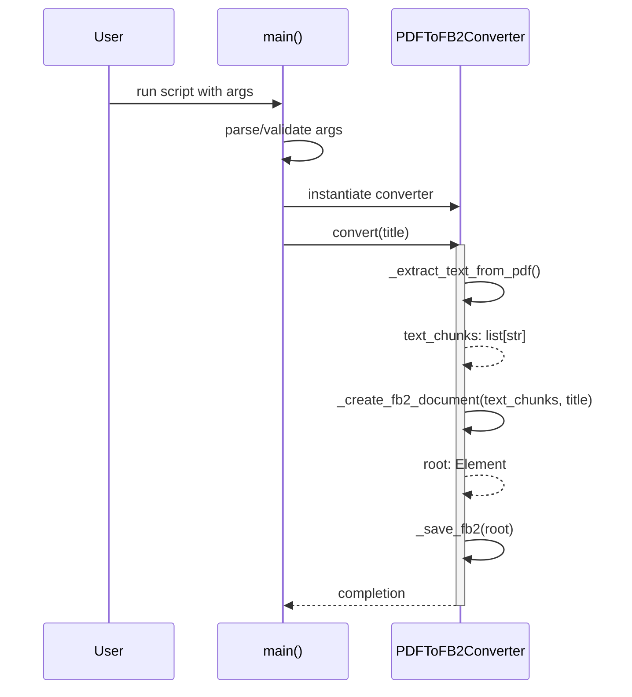

# PDF to FB2 Converter

A simple program to convert PDF files to FB2 (FictionBook 2.0) format for e-book readers.



## Installation

1. Install dependencies:
```bash
pip install -r requirements_converter.txt
```

or

```bash
pip install pypdf
```

## Usage

### Basic usage:
```bash
python pdf_to_fb2_converter.py book.pdf
```

This will create a `book.fb2` file in the same directory.

### With custom output file:
```bash
python pdf_to_fb2_converter.py book.pdf -o custom_name.fb2
```

### With custom book title:
```bash
python pdf_to_fb2_converter.py book.pdf -t "Book Title"
```

### Combination of options:
```bash
python pdf_to_fb2_converter.py book.pdf -o output.fb2 -t "My Favorite Book"
```

### Help:
```bash
python pdf_to_fb2_converter.py --help
```

## Architecture and Flow

### High-level workflow



### Method call sequence inside convert()



### Key responsibilities

- main(): CLI, arguments, validation, orchestration
- PDFToFB2Converter._extract_text_from_pdf(): read pages, extract text
- PDFToFB2Converter._clean_text(): normalize whitespace
- PDFToFB2Converter._create_fb2_document(): build FB2 XML structure
- PDFToFB2Converter._save_fb2(): pretty-print and write XML to disk

## Features

- ✅ Automatically extracts text from all PDF pages
- ✅ Creates properly structured FB2 file
- ✅ Cleans text from extra spaces
- ✅ Supports custom book titles
- ✅ Shows conversion progress
- ✅ Convenient command-line interface

## Requirements

- Python 3.7+
- pypdf 3.0+

## Notes

- The program works with PDF files that contain text (not scanned images)
- For best results, PDF should have properly recognized text
- Default author is set as "Unknown Author" (can be edited in code)

## FB2 Format

FB2 (FictionBook 2.0) is a popular e-book format, supported by:
- PocketBook
- Amazon Kindle
- FBReader
- Many other e-readers

## License

MIT License

Copyright (c) 2025

Permission is hereby granted, free of charge, to any person obtaining a copy
of this software and associated documentation files (the "Software"), to deal
in the Software without restriction, including without limitation the rights
to use, copy, modify, merge, publish, distribute, sublicense, and/or sell
copies of the Software, and to permit persons to whom the Software is
furnished to do so, subject to the following conditions:

The above copyright notice and this permission notice shall be included in all
copies or substantial portions of the Software.

THE SOFTWARE IS PROVIDED "AS IS", WITHOUT WARRANTY OF ANY KIND, EXPRESS OR
IMPLIED, INCLUDING BUT NOT LIMITED TO THE WARRANTIES OF MERCHANTABILITY,
FITNESS FOR A PARTICULAR PURPOSE AND NONINFRINGEMENT. IN NO EVENT SHALL THE
AUTHORS OR COPYRIGHT HOLDERS BE LIABLE FOR ANY CLAIM, DAMAGES OR OTHER
LIABILITY, WHETHER IN AN ACTION OF CONTRACT, TORT OR OTHERWISE, ARISING FROM,
OUT OF OR IN CONNECTION WITH THE SOFTWARE OR THE USE OR OTHER DEALINGS IN THE
SOFTWARE.
